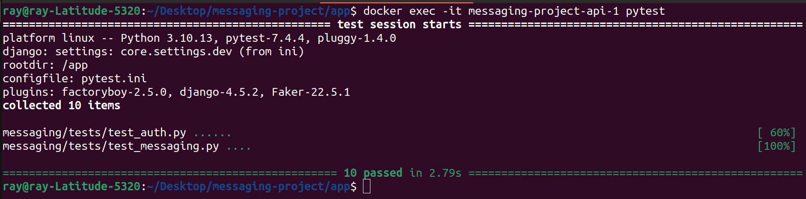
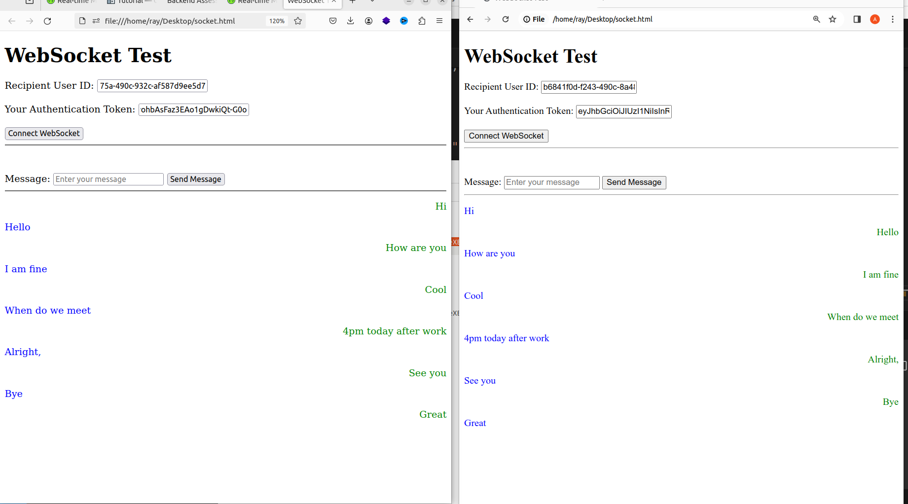

# Real-time Messaging App
Real-time messaging using http & websocket protocols

# Tools & Services:
- Django & DRF : for building the APIs
- Docker & Docker compose: Containerization
- Channel: Websocket connection 
- SQLite: Relational DB

# Running locally

Create a .env file by copying the .env.sample provided and run:

```
docker-compose -f docker-compose.dev.yml up --build
```
to build and run the container using the dev yaml file.

Access docs:
```sh
http://localhost:8000/api/v1/doc
```


# Run tests
Run descriptive tests in the container using:
```
docker compose exec <docker_container_name> pytest
```

or Run test in the app dir for activated an virtualenv using:

```
pytest -rP -vv
```

# Test Output


# Frontent


# Worflow
- Create 2 accounts on the system
- Login to the auth token for both users
- Open two tabs, supply a user's auth token and the recipient id i.e. (the other user)
- Click connect websocket 
- Start messaging

# Frontend improvement
- show a notification pop up if message type is message_read_status
- filter for appropriate user to know who to display the message to when there are multiple users interacting with a user.
